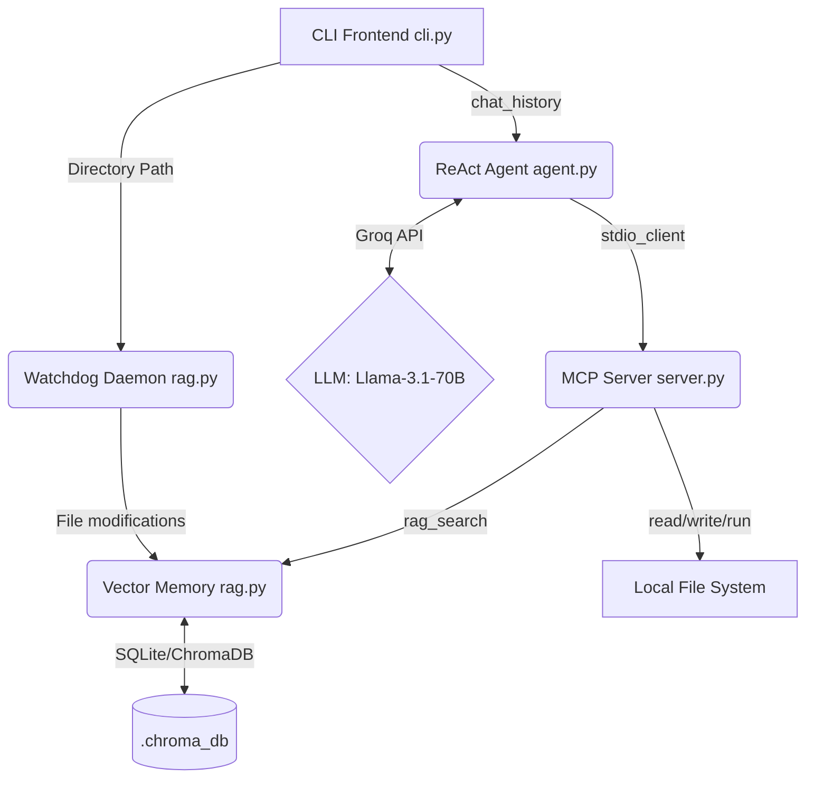

# Autonomous Codebase Guardian (CLI Edition)

A powerful, terminal-based AI agent designed to interact with, explore, and safely modify your codebase. Powered by **Groq (Llama 3.1)**, **Model Context Protocol (MCP)**, and **Tree-sitter AST Chunking**, this guardian understands the semantic structure of your code and executes tasks securely within a sandboxed environment.

## 🌟 Key Features

1. **Interactive Terminal Interface**: Built with `prompt_toolkit` and `rich`, providing a beautiful, chat-like REPL with multi-line input, history, and markdown rendering.
2. **AST-Aware Semantic Memory (RAG)**: Uses `tree-sitter-python` to parse code into logical chunks (classes/functions) rather than arbitrary text splits, preserving code logic. Stored locally in `ChromaDB`.
3. **Real-Time Watchdog Syncing**: Automatically listens for file changes in the background and performs delta-indexing, purging old ghost chunks and updating the vector database on the fly.
4. **Decoupled MCP Architecture**: The LLM reasoning loop (`agent.py`) communicates with a secure tool-execution subprocess (`server.py`) using the standard Model Context Protocol (v2) over stdio.
5. **Strict Directory Sandboxing**: Prevents the LLM from reading, writing, or executing commands outside of the explicitly allowed workspace directory.
6. **Automatic Error Recovery**: If the LLM hallucinates malformed JSON or a tool crashes, the Python stack trace is fed back into the prompt, allowing the agent to self-correct in the next reasoning step.

## 🛠 Architecture



## 🚀 Quick Start

### 1. Prerequisites
- Python 3.11+
- A [Groq API Key](https://console.groq.com/keys)

### 2. Installation
Clone the repository and set up your virtual environment:

```powershell
# Create and activate virtual environment
python -m venv venv
.\venv\Scripts\Activate.ps1  # On Windows
# source venv/bin/activate   # On Linux/Mac

# Install dependencies
pip install -r requirements.txt
```

### 3. Configuration
Rename or create a `.env` file in the root directory and add your Groq API key:
```env
GROQ_API_KEY=gsk_your_api_key_here
```

### 4. Running the Guardian
Start the CLI, passing the directory you want the agent to monitor and guard (e.g., the current directory `.`):
```powershell
python cli.py --dir .
```

## 💬 Usage & Slash Commands

Once the CLI is running, simply type your requests in natural language. For example:
- *"Explain how the AST chunking works in rag.py"*
- *"Find where the ChromaDB collection is initialized"*
- *"Run a command to check the current python version"*

**Available Slash Commands:**
- `/clear` - Clears the current conversation history to save tokens.
- `/sync` - Forces a manual sync of the vector database (though it happens automatically on save).
- `/exit` or `/quit` - Safely shuts down the agent and background daemons.

## 📂 Project Structure

- `cli.py`: The main entry point. Handles the REPL, rich formatting, and user interaction.
- `agent.py`: Contains the `CodebaseGuardianAgent` class. Manages the Groq ReAct loop and MCP client connection.
- `server.py`: The FastMCP server. Exposes sandboxed file system capabilities to the agent.
- `rag.py`: The memory engine. Handles Tree-sitter AST parsing, ChromaDB operations, and the Watchdog observer.
- `.cg_history`: A hidden file created automatically to store your command line prompt history for the session.

## 🛡 Security Note
The Guardian implements basic directory sandboxing by resolving all paths against the `--dir` argument. While this prevents accidental modification of files outside the workspace, it is highly recommended to review the agent's actions and commit your work frequently when using autonomous file-writing tools.
